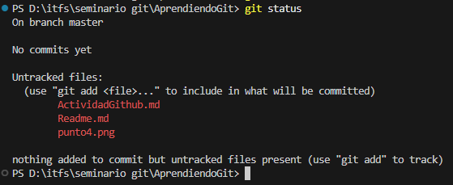
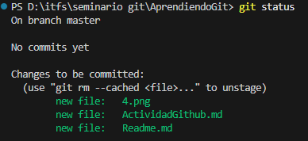
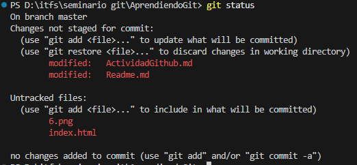

# Resolución Actividad Github

# 1

```
git config --global user.name "Ignacio Fiora"
git config --global user.email "ignaciofiora@gmail.com"
```

# 2

```
git init AprendiendoGit
cd AprendiendoGit
git status
```

# 3

Creé los archivos en el Explorador de Archivos de Windows y lo edité con VS Code

# 4

```
git status
```



# 5

```
git add .
```

# 6

```
git status
```



# 8

```
git commit -m "Fecha"
```

# 10


